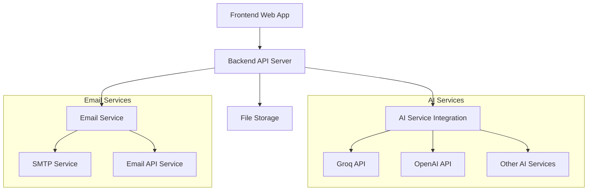

# Design Document

## Overview

The AI-powered meeting notes summarizer is a full-stack web application that processes text transcripts through AI services to generate customizable summaries and enables email sharing. The application follows a simple, functional design prioritizing ease of use over visual complexity.

The system architecture consists of a frontend web interface, a backend API server, AI service integration, and email delivery capabilities. The application will be deployed as a single cohesive unit with all components working together to provide a seamless user experience.

## Architecture

### High-Level Architecture



### Technology Stack

**Frontend:**
- HTML5, CSS3, JavaScript (Vanilla or lightweight framework)
- Simple, functional UI with minimal styling
- File upload handling and form management
- Real-time status updates during processing

**Backend:**
- Node.js with Express.js framework
- RESTful API design
- Middleware for file upload handling (multer)
- Environment-based configuration management

**AI Integration:**
- Primary: Groq API for fast inference
- Fallback: OpenAI API or similar services
- Configurable AI service selection
- Prompt engineering for different summary types

**Email Service:**
- SMTP integration (Gmail, SendGrid, or similar)
- HTML email template generation
- Recipient validation and error handling

**Deployment:**
- Platform: Vercel, Netlify, or similar serverless platform
- Environment variables for API keys and configuration
- Static frontend with serverless backend functions

## Components and Interfaces

### Frontend Components

**1. File Upload Component**
- Drag-and-drop file upload interface
- File validation (text formats: .txt, .md, .rtf)
- Preview area for uploaded transcript content
- Progress indicators for upload status

**2. Instruction Input Component**
- Text area for custom summarization instructions
- Predefined template options (executive summary, action items, etc.)
- Character count and validation feedback
- Help text with example instructions

**3. Summary Generation Component**
- Generate button with loading states
- Progress indicator during AI processing
- Error handling and retry mechanisms
- Summary display area with formatting preservation

**4. Summary Editor Component**
- Rich text editing capabilities (basic formatting)
- Auto-save functionality
- Undo/redo operations
- Word count and editing indicators

**5. Email Sharing Component**
- Multiple recipient email input with validation
- Subject line customization
- Email preview functionality
- Send confirmation and status feedback

### Backend API Endpoints

**POST /api/upload**
- Accepts multipart file uploads
- Validates file type and size
- Returns file ID and content preview
- Error handling for invalid files

**POST /api/summarize**
- Accepts transcript content and custom instructions
- Integrates with AI service APIs
- Returns structured summary response
- Handles AI service errors and timeouts

**PUT /api/summary/:id**
- Updates edited summary content
- Validates summary data
- Returns confirmation of updates
- Maintains summary version history

**POST /api/share**
- Accepts recipient emails and summary content
- Validates email addresses
- Sends formatted emails with summary
- Returns delivery status and confirmation

### AI Service Integration Interface

**AI Service Abstraction Layer**
```javascript
interface AIService {
  generateSummary(transcript: string, instructions: string): Promise<Summary>
  validateConnection(): Promise<boolean>
  getServiceStatus(): ServiceStatus
}
```

**Summary Response Format**
```javascript
interface Summary {
  id: string
  content: string
  metadata: {
    wordCount: number
    processingTime: number
    aiService: string
    timestamp: Date
  }
}
```

## Data Models

### Transcript Model
```javascript
{
  id: string
  filename: string
  content: string
  uploadedAt: Date
  fileSize: number
  mimeType: string
}
```

### Summary Model
```javascript
{
  id: string
  transcriptId: string
  originalContent: string
  editedContent: string
  instructions: string
  aiService: string
  createdAt: Date
  lastModified: Date
  shareHistory: ShareRecord[]
}
```

### Share Record Model
```javascript
{
  id: string
  summaryId: string
  recipients: string[]
  sentAt: Date
  status: 'pending' | 'sent' | 'failed'
  emailSubject: string
}
```

## Error Handling

### Frontend Error Handling
- User-friendly error messages for all failure scenarios
- Retry mechanisms for transient failures
- Graceful degradation when services are unavailable
- Input validation with immediate feedback

### Backend Error Handling
- Comprehensive error logging and monitoring
- Structured error responses with appropriate HTTP status codes
- Rate limiting and abuse prevention
- Timeout handling for external service calls

### AI Service Error Handling
- Fallback to alternative AI services when primary service fails
- Retry logic with exponential backoff
- Service health monitoring and automatic failover
- Clear error messages for service-specific issues

### Email Service Error Handling
- Validation of email addresses before sending
- Retry mechanisms for failed email deliveries
- Bounce handling and delivery status tracking
- Alternative email service fallback options

## Testing Strategy

### Unit Testing
- Frontend component testing with Jest or similar framework
- Backend API endpoint testing with comprehensive test cases
- AI service integration mocking and testing
- Email service integration testing with mock providers

### Integration Testing
- End-to-end workflow testing from upload to email delivery
- Cross-browser compatibility testing for frontend
- API integration testing with real AI services (in staging)
- Email delivery testing with test email accounts

### Performance Testing
- File upload performance with various file sizes
- AI service response time monitoring and optimization
- Concurrent user load testing
- Email delivery performance under load

### Security Testing
- File upload security validation (malicious file prevention)
- Input sanitization and XSS prevention
- API rate limiting and abuse prevention
- Email injection and spam prevention testing

## Deployment Architecture

### Environment Configuration
- Development: Local development with mock services
- Staging: Full integration with test AI and email services
- Production: Live services with monitoring and logging

### Serverless Deployment Strategy
- Frontend: Static site deployment (Vercel/Netlify)
- Backend: Serverless functions for API endpoints
- Environment variables for all sensitive configuration
- CDN integration for optimal performance

### Monitoring and Logging
- Application performance monitoring
- Error tracking and alerting
- AI service usage and cost monitoring
- Email delivery success rate tracking